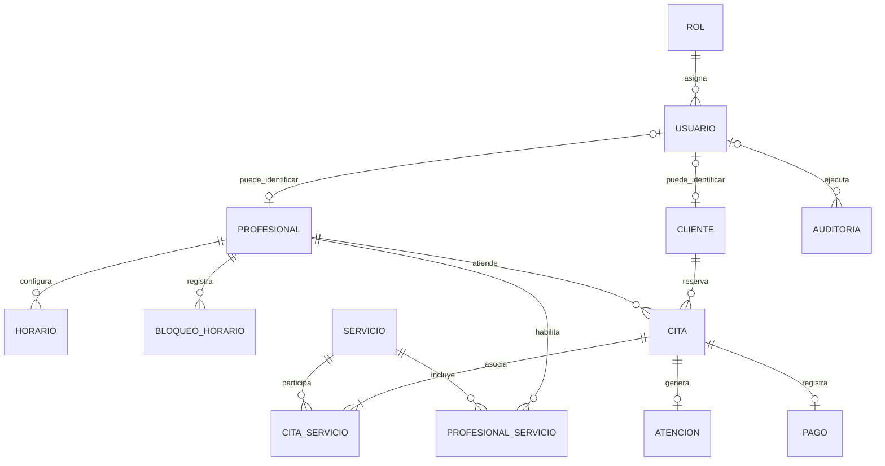

# DER lógico v0.1 — SalonPro

## 1. Fuente

- Proyecto oficial: **SalonPro**
- Base inmediata: `model-relational-v0.1.md`
- Etapa: **Clase 04 — diseño lógico**
- Frontera técnica: todavía **sin `CREATE TABLE`**, sin tipos PostgreSQL y sin JPA.

El DER lógico v0.1 transforma el modelo relacional aprobado en una representación defendible de tablas, claves, relaciones, obligatoriedad y unicidades preliminares.

---

## 2. Convenciones

- **PK** = clave primaria
- **FK** = clave foránea
- **UQ** = unicidad
- **NN** = obligatorio
- **NULL** = puede faltar legítimamente
- **PENDIENTE** = decisión que no debe cerrarse sin respaldo adicional

---

## 3. Diagrama lógico

### Lectura principal del DER

1. Un `Rol` puede estar asociado a varios `Usuario`.
2. Un `Cliente` puede tener varias `Cita`.
3. Un `Profesional` puede tener varias `Cita`.
4. Un `Profesional` puede tener varios `Horario`.
5. Un `Profesional` puede tener varios `BloqueoHorario`.
6. `Profesional` y `Servicio` se vinculan mediante `ProfesionalServicio`.
7. `CitaServicio` materializa la asociación entre `Cita` y `Servicio`.
8. Una `Cita` puede llegar a generar una `Atencion`.
9. Una `Cita` puede llegar a registrar un `Pago`.
10. `Auditoria` conserva trazabilidad de operaciones críticas cuando existe un usuario identificable.

> **Nota de diseño:** `CitaServicio` forma parte del modelo mínimo oficial. El DER lo representa como entidad asociativa. La cantidad funcional exacta de servicios permitidos por cita se documentará como decisión de negocio si requiere una restricción adicional; no se deduce únicamente del nombre de la tabla.

---

## 4. Tablas lógicas

### rol

**Propósito:** representar los roles de acceso del sistema.

- `rol_id` — **PK, NN**
- `nombre_rol` — **NN, UQ**

**Dominio preliminar de `nombre_rol`:**
- Administrador
- Recepcionista
- Profesional
- Cliente
- Supervisor

**Justificación:** actores oficiales de SalonPro.

---

### usuario

**Propósito:** representar la identidad de acceso al sistema.

- `usuario_id` — **PK, NN**
- `rol_id` — **FK -> rol.rol_id, NN**

**PENDIENTE:** el identificador concreto de autenticación y las credenciales se definirán cuando exista respaldo suficiente; no se inventan en el DER lógico.

---

### profesional

**Propósito:** representar al profesional que presta servicios.

- `profesional_id` — **PK, NN**
- `usuario_id` — **FK -> usuario.usuario_id, NULL, UQ candidato**

**Decisión lógica v0.1:** `usuario_id` puede ser NULL para no impedir que el administrador configure un profesional antes de asignarle una cuenta de acceso. Si existe vínculo con usuario, se propone que corresponda como máximo a una cuenta.

---

### servicio

**Propósito:** representar el catálogo de servicios del salón.

- `servicio_id` — **PK, NN**
- `nombre` — **NN**
- `duracion` — **NN**

**Justificación:** RF-02 y RN-02.

---

### profesional_servicio

**Propósito:** representar qué profesionales están habilitados para prestar cada servicio.

- `profesional_id` — **PK, FK -> profesional.profesional_id, NN**
- `servicio_id` — **PK, FK -> servicio.servicio_id, NN**

**UQ:** la PK compuesta (`profesional_id`, `servicio_id`) evita duplicar la misma habilitación.

**Justificación:** RF-03 y RN-03.

---

### horario

**Propósito:** representar los horarios base configurados para cada profesional.

- `horario_id` — **PK, NN**
- `profesional_id` — **FK -> profesional.profesional_id, NN**
- `dia_semana` — **NN**
- `hora_inicio` — **NN**
- `hora_fin` — **NN**

**Dominio preliminar:** `dia_semana` debe pertenecer a un conjunto válido de días de la semana.

**Regla preliminar:** `hora_fin` debe ser posterior a `hora_inicio`.

---

### bloqueo_horario

**Propósito:** representar intervalos de agenda que no pueden ofrecerse como disponibles.

- `bloqueo_horario_id` — **PK, NN**
- `profesional_id` — **FK -> profesional.profesional_id, NN**
- `fecha_hora_inicio` — **NN**
- `fecha_hora_fin` — **NN**

**Decisión lógica v0.1:** el bloqueo se vincula al profesional cuya disponibilidad afecta.

**Regla preliminar:** `fecha_hora_fin` debe ser posterior a `fecha_hora_inicio`.

**Justificación:** RF-05 y RN-07.

---

### cliente

**Propósito:** representar a la persona que reserva y recibe servicios.

- `cliente_id` — **PK, NN**
- `usuario_id` — **FK -> usuario.usuario_id, NULL, UQ candidato**

**Decisión lógica v0.1:** un cliente puede existir sin cuenta de acceso porque puede ser registrado operativamente; si se vincula a un usuario, se propone como máximo una cuenta por cliente.

**Justificación:** RF-07 y actor Cliente.

---

### cita

**Propósito:** representar una reserva de un cliente con un profesional en un intervalo determinado.

- `cita_id` — **PK, NN**
- `cliente_id` — **FK -> cliente.cliente_id, NN**
- `profesional_id` — **FK -> profesional.profesional_id, NN**
- `fecha_hora_inicio` — **NN**
- `fecha_hora_fin` — **NN**
- `estado` — **NN**

**Dominio preliminar de `estado`:**
- reservada
- confirmada
- en atención
- finalizada
- cancelada
- no asistió

**Reglas preliminares:**
- `fecha_hora_fin` debe ser posterior a `fecha_hora_inicio`.
- El mismo profesional no puede tener citas solapadas.
- El control configurable de solapamiento personal del cliente se valida en lógica de negocio.
- Las citas históricas deben conservarse.

**Justificación:** RN-01, RN-05, RN-06 y RN-09; RF-08 a RF-13.

---

### cita_servicio

**Propósito:** representar la asociación entre una cita y el servicio correspondiente, conservando el precio aplicado cuando la cita es confirmada.

- `cita_servicio_id` — **PK, NN**
- `cita_id` — **FK -> cita.cita_id, NN**
- `servicio_id` — **FK -> servicio.servicio_id, NN**
- `precio_aplicado` — **NN al quedar confirmada la cita**

**UQ candidato:** (`cita_id`, `servicio_id`) para evitar repetir exactamente el mismo servicio dentro de la misma cita.

**Justificación:** entidad mínima oficial `CitaServicio`, RN-02, RN-03 y RN-08.

**Nota:** el DER no afirma que el negocio exija múltiples servicios por cita; únicamente representa la asociación oficial requerida.

---

### atencion

**Propósito:** registrar el inicio y fin de la atención efectiva vinculada a una cita.

- `atencion_id` — **PK, NN**
- `cita_id` — **FK -> cita.cita_id, NN, UQ**
- `fecha_hora_inicio` — **NN**
- `fecha_hora_fin` — **NULL hasta finalizar la atención**

**Decisión lógica v0.1:** una cita genera como máximo un registro de atención en el MVP. La atención puede existir sin fecha de fin mientras se encuentra en curso.

**Justificación:** RF-12 y flujo crítico.

---

### pago

**Propósito:** registrar el pago operativo simplificado de una cita.

- `pago_id` — **PK, NN**
- `cita_id` — **FK -> cita.cita_id, NN, UQ**
- `monto` — **NN**
- `fecha_hora` — **NN**

**Decisión lógica v0.1:** para el MVP se registra como máximo un pago operativo consolidado por cita. Esta es una decisión de diseño del equipo, no una regla textual de RN-10.

**Justificación:** RF-14 y RN-10.

---

### auditoria

**Propósito:** conservar trazabilidad suficiente de operaciones críticas y cambios de agenda.

- `auditoria_id` — **PK, NN**
- `accion` — **NN**
- `fecha_hora` — **NN**
- `usuario_id` — **FK -> usuario.usuario_id, NULL**

**Decisión lógica v0.1:** `usuario_id` puede ser NULL únicamente cuando el evento auditado no pueda atribuirse legítimamente a un usuario autenticado. Los datos adicionales necesarios para identificar el registro afectado se definirán en el diccionario/decisiones de integridad antes del diseño físico.

**Justificación:** RF-18 y criterio global de trazabilidad.

---

## 5. Relaciones lógicas

| # | Relación | Cardinalidad lógica | Implementación lógica |
|---:|---|---|---|
| 1 | Rol — Usuario | 1:N | `usuario.rol_id` |
| 2 | Usuario — Cliente | 0..1 : 0..1 | `cliente.usuario_id` nullable + UQ candidato |
| 3 | Usuario — Profesional | 0..1 : 0..1 | `profesional.usuario_id` nullable + UQ candidato |
| 4 | Cliente — Cita | 1:N | `cita.cliente_id` |
| 5 | Profesional — Cita | 1:N | `cita.profesional_id` |
| 6 | Profesional — Horario | 1:N | `horario.profesional_id` |
| 7 | Profesional — BloqueoHorario | 1:N | `bloqueo_horario.profesional_id` |
| 8 | Profesional — Servicio | N:M | `profesional_servicio` |
| 9 | Cita — Servicio | asociación mediante `cita_servicio` | `cita_servicio.cita_id` + `servicio_id` |
| 10 | Cita — Atencion | 1 : 0..1 | `atencion.cita_id` + UQ |
| 11 | Cita — Pago | 1 : 0..1 | `pago.cita_id` + UQ |
| 12 | Usuario — Auditoria | 1 : 0..N, vínculo opcional desde Auditoria | `auditoria.usuario_id` |

---

## 6. Unicidades preliminares

| Tabla | Campo / combinación | Tipo | Justificación |
|---|---|---|---|
| `rol` | `nombre_rol` | UQ global | No deben existir dos filas para el mismo rol oficial. |
| `profesional_servicio` | (`profesional_id`, `servicio_id`) | PK compuesta | Una habilitación idéntica no debe duplicarse. |
| `cliente` | `usuario_id` | UQ cuando exista | Una misma cuenta no debe identificar a dos clientes. |
| `profesional` | `usuario_id` | UQ cuando exista | Una misma cuenta no debe identificar a dos profesionales. |
| `cita_servicio` | (`cita_id`, `servicio_id`) | UQ candidata | Evita repetir exactamente la misma asociación cita-servicio. |
| `atencion` | `cita_id` | UQ | Máximo una atención por cita en el MVP. |
| `pago` | `cita_id` | UQ | Máximo un pago operativo por cita en el MVP. |

---

## 7. Nulabilidad principal

| Tabla.campo | ¿Puede ser NULL? | Justificación |
|---|---|---|
| `profesional.usuario_id` | Sí | El profesional puede configurarse antes de disponer de cuenta. |
| `cliente.usuario_id` | Sí | Un cliente puede ser registrado operativamente sin cuenta. |
| `atencion.fecha_hora_fin` | Sí | Durante una atención en curso todavía no existe hora de finalización. |
| `auditoria.usuario_id` | Sí | Sólo cuando no exista usuario autenticado atribuible al evento. |
| `cita.cliente_id` | No | Toda cita necesita cliente. |
| `cita.profesional_id` | No | Toda cita necesita profesional para aplicar RN-01 y RN-03. |
| `cita.estado` | No | El ciclo de vida de la cita requiere estado válido. |
| `cita_servicio.cita_id` | No | La asociación no existe sin cita. |
| `cita_servicio.servicio_id` | No | La asociación no existe sin servicio. |
| `pago.cita_id` | No | Un pago operativo debe pertenecer a una cita. |

---

## 8. Reglas que afectan el modelo

- **RN-01 — No solapamiento por profesional:** el DER conserva `profesional_id`, `fecha_hora_inicio` y `fecha_hora_fin`; la protección completa requiere lógica transaccional/backend.
- **RN-02 — Duración según servicio:** `servicio.duracion` es obligatorio y se relaciona con la cita mediante `cita_servicio`.
- **RN-03 — Profesional habilitado:** la asociación válida se representa con `profesional_servicio`.
- **RN-04 — Cancelaciones tardías registradas:** la cita conserva su estado/histórico y la auditoría debe aportar trazabilidad suficiente.
- **RN-05 — Estados válidos:** `cita.estado` utiliza un dominio preliminar controlado.
- **RN-06 — No eliminar históricos:** la conservación se tratará como decisión de integridad y política de persistencia; no se resuelve con el DER por sí solo.
- **RN-07 — Bloqueos no disponibles:** `bloqueo_horario` conserva el profesional y el intervalo bloqueado.
- **RN-08 — Precio congelado al confirmar:** `cita_servicio.precio_aplicado` conserva el valor aplicado a la cita.
- **RN-09 — Solapamiento personal configurable:** los intervalos y `cliente_id` permiten aplicar la regla desde backend.
- **RN-10 — Pago operativo:** `pago` representa únicamente el registro operacional del MVP, sin pasarela bancaria real.

---

## 9. Comprobación contra el flujo crítico

| Paso | Entidades principales | Soporte del DER |
|---|---|---|
| Administrador configura servicio/profesional/horario | `servicio`, `profesional`, `profesional_servicio`, `horario` | Catálogo, habilitación y disponibilidad base. |
| Cliente consulta disponibilidad | `horario`, `bloqueo_horario`, `cita`, `profesional_servicio`, `servicio` | Permite calcular slots válidos. |
| Cliente reserva | `cliente`, `cita`, `cita_servicio`, `profesional` | Conserva cliente, profesional, intervalo y servicio. |
| Recepcionista confirma | `cita`, `cita_servicio`, `auditoria` | Estado válido, precio aplicado y trazabilidad. |
| Profesional inicia/finaliza atención | `cita`, `atencion` | Conserva inicio/fin real y estado. |
| Se registra pago | `pago`, `cita` | Conserva pago operativo asociado. |
| Dashboard refleja ocupación e ingresos | `cita`, `horario`, `atencion`, `pago` | Datos suficientes para RF-17. |

---

## 10. Decisiones de diseño que deben quedar trazadas

Las siguientes decisiones no se presentan como requisitos textuales de la ficha, sino como decisiones lógicas v0.1 del equipo y deben repetirse en `decisiones-integridad-v0.1.md`:

1. `cliente.usuario_id` y `profesional.usuario_id` son opcionales.
2. Si existe vínculo Usuario–Cliente o Usuario–Profesional, se propone unicidad del `usuario_id`.
3. `BloqueoHorario` se vincula directamente a `Profesional`.
4. Una cita tiene como máximo una `Atencion` en el MVP.
5. Una cita tiene como máximo un `Pago` operativo en el MVP.
6. `atencion.fecha_hora_fin` es nullable mientras la atención está en curso.
7. La multiplicidad funcional exacta de servicios por cita no se deduce únicamente de `CitaServicio`; cualquier restricción adicional debe documentarse explícitamente.

---

## 11. Estado del documento

**DER lógico v0.1 preparado para revisión cruzada.**

Todavía no corresponde:
- elegir tipos PostgreSQL;
- escribir `CREATE TABLE`;
- crear migraciones;
- crear entidades JPA;
- implementar restricciones físicas.

El siguiente artefacto de la misma Clase 04 es `diccionario-datos-v0.1.md`.
